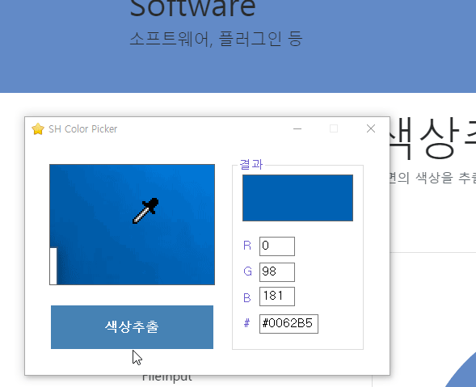

# 색상 코드 추출 SHColorPicker
색상코드를 확인하는 가벼운 소프트웨어입니다.

마우스 커서를 기준으로 RGB 색상 코드(`255,255,255`) 또는 HTML 코드(예: `#ffffff`)를 볼 수 있습니다.

급하게 사용하기에 좋습니다.

## 호환성
.Net 4.0 이상
- `System.Threading.Tasks`가 4.0 이상에서 지원됨. 그 이하에서 지원하려면 NuGet으로 다른 패키지를 설치해서 대체해야 함. 귀찮으니 Pass...

## 기타
C#으로 작성되었습니다. (C++로 하려다가 어째선지 C#으로 작성이 되버렸음)
